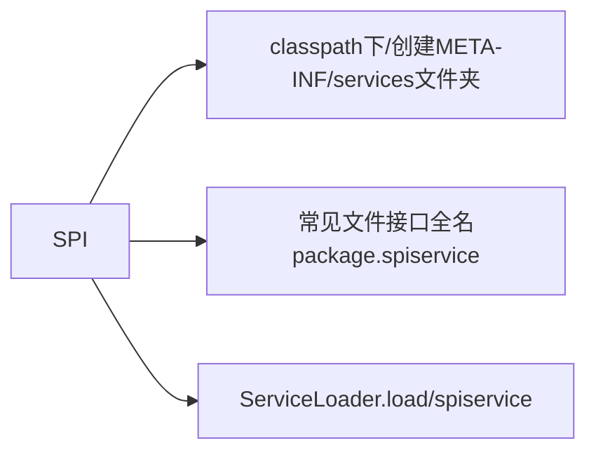

## SPI(Service Provider Interface)

## 用例
~~~
//spi接口
@FunctionalInterface
public interface SpiService {
    String testSpi();
}

//spi实现类
public class SpiServiceBImpl implements SpiService {
    @Override
    public String testSpi() {
        String result = "SpiServiceBImpl testSpi";
        System.out.println(result);
        return result;
    }
}

//测试
@Slf4j
public class TestCase {
    @Test
    public void test() {
        ServiceLoader<SpiService> spiLoader = ServiceLoader.load(SpiService.class);
        for(SpiService spiService : spiLoader) {
            spiService.testSpi();
        }
    }
}
~~~
