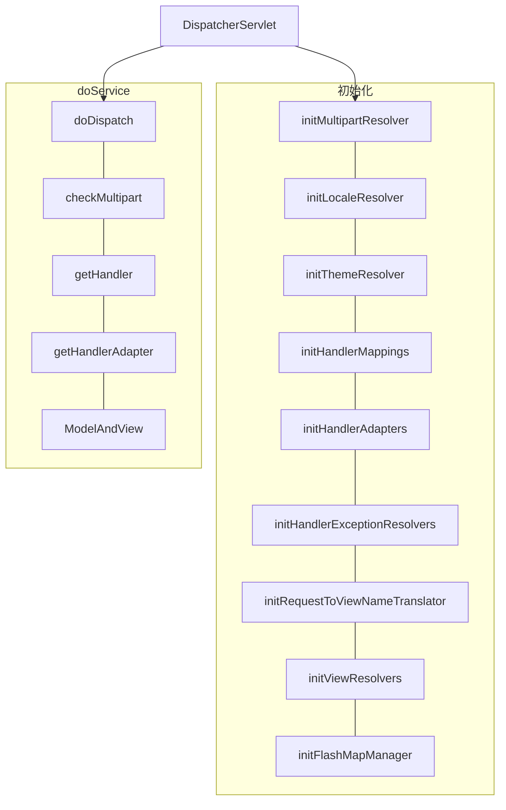

```mermaid
graph TB
    DispatcherServlet-->initMultipartResolver[initMultipartResolver]
    DispatcherServlet-->doDispatch[doDispatch]
    subgraph 初始化
        initMultipartResolver
        ---initLocaleResolver
        ---initThemeResolver
        ---initHandlerMappings
        ---initHandlerAdapters
        ---initHandlerExceptionResolvers
        ---initRequestToViewNameTranslator
        ---initViewResolvers
        ---initFlashMapManager
    end
    subgraph doService
      doDispatch
      ---checkMultipart
      ---getHandler
      ---getHandlerAdapter
      ---ModelAndView
    end
```
